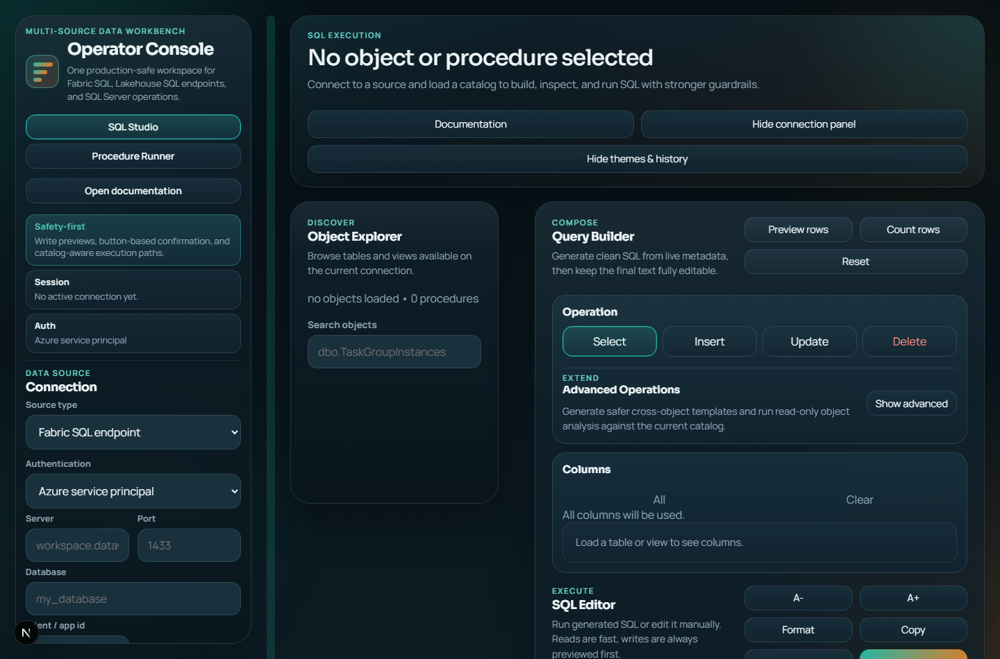
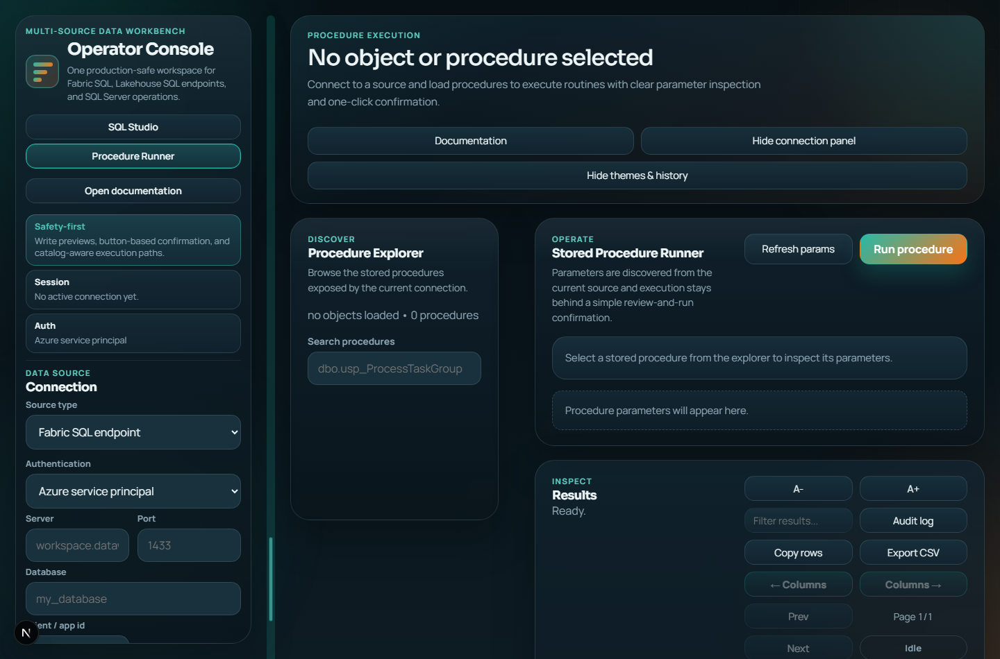
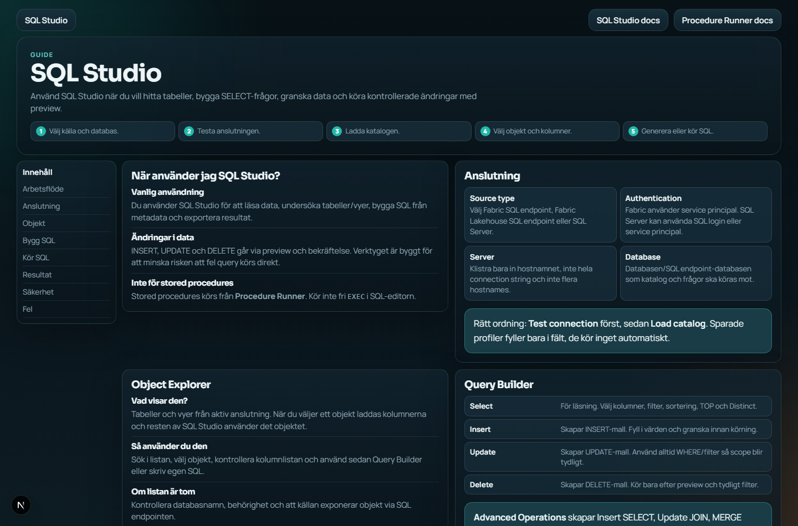

# Data Workbench Console



Production-safe internal SQL workbench for Microsoft Fabric SQL endpoints, Fabric Lakehouse SQL endpoints, and SQL Server.

Data Workbench Console is built for controlled operational work: browse metadata, generate SQL, run read queries, preview writes before execution, run stored procedures from a dedicated flow, and keep an audit trail of important actions.

Current app version: `1.4.18`. See [CHANGELOG.md](CHANGELOG.md) for release notes.

<p>
  
  
  
  
</p>


## License / Ownership

Copyright (c) 2026 Mohamed Almefrej. All rights reserved.

This project is proprietary. You may not copy, modify, distribute, publish,
host, sell, transfer, or use this code without explicit written permission from
the copyright owner.

> **Internal tool warning**
>
> This app can connect to real databases and execute writes/procedures when the connected source allows it. Do not publish it with real `.env` secrets, audit logs, saved connections, or production credentials. Put authentication/SSO or a private network boundary in front of any hosted deployment.

## What You Can Do

| Area | What it gives you |
| --- | --- |
| SQL Studio | Browse tables/views, generate SQL, run SELECT queries, preview writes, inspect results, export CSV. |
| Procedure Runner | Browse stored procedures, inspect parameters, prepare execution, confirm, view output/return values. |
| Object scripting | Load CREATE or ALTER/Edit scripts for tables, views, and procedures into the SQL editor for review. |
| Metadata tools | Profile objects, inspect dependencies, compare schemas, estimate read-query plans, inspect result shape, row counts, and top values. |
| Mode switching | Switch between SQL Studio and Procedure Runner from the top workspace header, even when the connection panel is hidden. |
| Workspace restore | Return to each mode with the editor, filters, selected procedure, parameter values, result tabs, pagination, and local result filters restored for the current browser tab. |
| Mode-specific history | SQL Studio shows SQL history. Procedure Runner shows procedure run history and can restore saved parameter values. |
| Connection profiles | Save reusable connection details without storing passwords or client secrets. |
| Explorer workflow | Pin and filter objects/procedures by type, schema, recent use, pinned state, object name, and loaded column names. |
| Audit | Track and filter connection tests, catalog loads, metadata reads, query execution, write previews, procedure execution, and saved profile changes. |
| Workbench tools | Open quick actions, SQL safety summary, local scratchpads, and safe diagnostics from one compact modal. |
| App settings | Edit local `.env` settings through a guided interface with descriptions, typed controls, and restart guidance. |
| Support | Fill a support form, include safe diagnostics, select a screenshot, and open an email draft to the maintainer. |
| Self-update | Git-installed local copies can show an `Update` button when the remote app version is newer. |
| Documentation | Built-in user docs at `/docs/sql-studio` and `/docs/procedure-runner`. |

## Screenshots

### SQL Studio


### Procedure Runner



### Built-in Documentation



## For Users

1. Open the app in your browser.
2. Choose the source type:
   - `Fabric SQL endpoint`
   - `Fabric Lakehouse SQL endpoint`
   - `SQL Server`
3. Enter server, port, database, and authentication details.
4. Click `Test connection`.
5. Click `Load catalog`.
6. Use `SQL Studio` for tables, views, SQL generation, query execution, and results.
7. Use `Procedure Runner` for stored procedures where the selected source supports them.
8. Switch modes from the top of the workspace. The app keeps each mode where you left it during the same browser tab session.
9. Use Advanced Operations for read-only metadata tools such as profile, dependency view, row count, top values, result shape, schema compare, and estimated plans.
10. Use `Tools` for command shortcuts, scratchpads, current SQL review, and diagnostics.
11. Use `Settings` to edit local `.env` values without opening files manually. Restart the app after applying changes.
12. Use `Support` to prepare a bug report email with safe app context.

History behavior:

- In `SQL Studio`, the history panel shows recent SQL only.
- In `Procedure Runner`, the history panel shows procedure runs only.
- Clicking a procedure history item restores the selected procedure and the parameter values used for that run.
- If the active connection differs from the connection used by the history item, check the connection before running again.

Useful pages:

- `/` - SQL Studio
- `/procedures` - Procedure Runner

## Non-Technical Windows Install Guide

Use this guide for colleagues who should run Data Workbench locally and receive updates without manually downloading new zip files.

### What You Need First

Ask IT or the app maintainer for:

- access to the Data Workbench repository
- Node.js `>=20` installed on the computer
- Git for Windows installed on the computer
- the correct Fabric service-principal values if Fabric sources will be used:
  - `AZURE_CLIENT_ID`
  - `AZURE_CLIENT_SECRET`
  - `AZURE_TENANT_ID`

Recommended install location:

```text
C:\Users\<your-user>\Desktop\data-workbench-console
```

Avoid installing the app inside `Downloads`, OneDrive sync folders, or temporary zip extraction folders.

### One-Time Installation

1. Open the Windows Start menu.
2. Search for `PowerShell`.
3. Open PowerShell.
4. Go to the Desktop:

```powershell
cd "$env:USERPROFILE\Desktop"
```

5. Download the app with Git:

```powershell
git clone https://github.com/MohamedMrj/data-workbench-console.git
```

6. Go into the app folder:

```powershell
cd data-workbench-console
```

7. Install the app dependencies:

```powershell
npm install
```

8. Create the local settings file:

```powershell
Copy-Item .env.example .env
```

9. Create the Desktop shortcut by double-clicking:

```text
Create Desktop Shortcut.bat
```

After this, start the app from the `Data Workbench Console` Desktop shortcut.

### First Startup

The first startup can take longer because the app may need to build the production version. The launcher shows progress while it prepares the local server.

When the browser opens:

1. Click `Settings`.
2. Fill in the Fabric authentication values if your source uses Fabric.
3. Click `Apply settings`.
4. Close Data Workbench.
5. Start it again from the Desktop shortcut.

The `.env` file is your private local settings file. It is not replaced by app updates.

### Daily Use

1. Double-click `Data Workbench Console` on the Desktop.
2. Wait for the browser to open.
3. Choose or click a saved profile.
4. The catalog loads automatically when the saved profile has enough connection information.
5. Use SQL Studio or Procedure Runner.
6. Click `Exit Data Workbench` when finished if you want to stop the local server immediately.

### Getting Updates

Do not download a new zip for normal updates. Git-installed copies can update themselves.

When a new version is available, an `Update` button appears in the app header. Click it to:

- download the latest app code
- keep your `.env` settings
- keep local `.data`, saved profiles, audit logs, and history
- rebuild the app
- restart the local server
- reload the browser

If the `Update` button does not appear, the app is either already current or the update check cannot reach the Git repository.

### If Something Goes Wrong

Use these checks before asking for support:

- Make sure Node.js is installed:

```powershell
node --version
```

- Make sure Git is installed:

```powershell
git --version
```

- Check launcher and update logs:

```text
.data\logs\data-workbench-launcher.log
.data\logs\data-workbench-update.log
.data\logs\data-workbench-server.log
```

- Use the in-app `Support` button to prepare a bug report with safe diagnostics.

### Important Rules For Users

- Do not edit app source files.
- Do not delete `.env`.
- Do not share `.env` because it can contain secrets.
- Do not use zip downloads for users who need updates.
- Use `Settings` in the app instead of opening `.env` manually.

## Windows Launcher

For a clean Desktop shortcut on Windows, run:

```bat
Create Desktop Shortcut.bat
```

This creates a `Data Workbench Console` shortcut on the current user's Desktop. The shortcut uses the hidden launcher, opens a browser startup screen immediately without relying on `.html` file association, shows live percent/time-left progress while the local production server starts, and switches to SQL Studio automatically when the server is ready.

The browser sends a local heartbeat while Data Workbench is open. When the final app tab is closed, the hidden local server shuts down after a two-hour inactivity grace period. Users can also click `Exit Data Workbench` in the app header to stop the server immediately.

Startup details are written under `.data/logs/` so runtime logs do not clutter the project root.

### App Settings

The `Settings` button opens a guided editor for the local `.env` file. It groups runtime, database, query safety, audit, desktop lifecycle, side-panel auto-hide, appearance, request guardrail, and Fabric authentication settings.

Important behavior:

- settings are saved to `.env` in the app folder
- most settings are read when the server starts, so restart Data Workbench after applying changes
- side-panel auto-hide can be turned off or adjusted with `APP_SIDE_PANEL_AUTO_HIDE_ENABLED`, `APP_SIDE_PANEL_IDLE_MS`, and `APP_SIDE_PANEL_FADE_MS`
- subtle background color motion can be turned off or slowed down with `APP_AMBIENT_MOTION_ENABLED` and `APP_AMBIENT_MOTION_DURATION_MS`
- helpful tooltips can be turned off or delayed with `APP_TOOLTIPS_ENABLED` and `APP_TOOLTIP_DELAY_MS`
- `AZURE_CLIENT_SECRET` is never returned to the browser; leave it blank to keep the existing secret, or type a new value to replace it
- unknown settings and invalid values are rejected
- the settings API is local-only and write-protected by same-origin checks

### Updates For Local Desktop Users

Use `git clone` installs for users who should receive updates. Zip-folder installs are fixed copies and cannot safely self-update because they do not know the remote repository.

When the app is a Git checkout and `origin/main` is ahead, the workspace header shows an `Update` button. Clicking it:

- pulls the latest code with Git
- preserves local `.env`, `.data`, saved profiles, audit logs, and pending confirmations
- installs dependencies when `package-lock.json` changed
- rebuilds the production app
- restarts the hidden local server
- reloads the browser when the server is ready

Update logs are written to `.data/logs/data-workbench-update.log`. Set `APP_SELF_UPDATE_ENABLED=false` to hide the update path from the API while keeping version checks available.

- `/docs/sql-studio` - SQL Studio guide
- `/docs/procedure-runner` - Procedure Runner guide

## For Developers Cloning The Repo

Prerequisites:

- Node.js `>=20`
- npm
- Network access to the SQL endpoints you want to use, usually outbound TCP `1433`
- For Microsoft Fabric sources, an Azure/Fabric service principal with access to the target workspace and SQL endpoint

Clone the repository:

```bash
git clone https://github.com/MohamedMrj/data-workbench-console.git
cd data-workbench-console
```

Install dependencies from the lockfile:

```bash
npm ci
```

Create a local environment file:

```bash
cp .env.example .env
```

On Windows PowerShell, use:

```powershell
Copy-Item .env.example .env
```

Then edit `.env` and set the Fabric service-principal values if you want to connect to Fabric:

```env
AZURE_CLIENT_ID=your-client-id
AZURE_CLIENT_SECRET=your-client-secret
AZURE_TENANT_ID=your-tenant-id
```

Run the development server:

```bash
npm run dev
```

Open:

```text
http://localhost:3000
```

Build and run production locally:

```bash
npm run build
npm run start
```

Run the full local verification suite:

```bash
npm run verify
```

## Local Project Commands

| Command | Purpose |
| --- | --- |
| `npm run dev` | Start the local Next.js development server. |
| `npm run build` | Create a production build. |
| `npm run start` | Run the production build locally. |
| `npm run clean` | Remove `.next`. Useful if Next dev cache gets corrupted. |
| `npm run responsive:audit` | Run the Playwright responsive layout audit across populated SQL and procedure states. |
| `npm run verify` | Clean, build, run SQL classifier tests, SQL metadata tests, backend smoke test, UI smoke test, and responsive audit. |

## Environment Setup

Use `.env.example` as the template. Never commit your real `.env`.

Minimum for local UI-only startup:

```env
PORT=3000
DB_PORT=1433
```

Required for Fabric service-principal authentication:

```env
AZURE_CLIENT_ID=your-client-id
AZURE_CLIENT_SECRET=your-client-secret
AZURE_TENANT_ID=your-tenant-id
```

Runtime data is local by default:

```env
AUDIT_LOG_FILE=./audit-log.ndjson
APP_DATA_DIR=data
CONFIRMATION_STORE_FILE=.data/pending-confirmations.json
```

These files are ignored by git and should stay private.

## Purpose

This app provides a browser-based operator console for:

- connecting to supported SQL-capable sources
- loading object and procedure catalogs from the active source
- generating SQL from live metadata
- running read queries directly
- previewing and confirming write queries before execution
- running stored procedures from a dedicated workflow with explicit confirmation
- scripting tables, views, and procedures into the editor without auto-execution
- comparing schemas and inspecting read-only metadata
- reviewing a persistent audit trail of actions performed through the app

It is intentionally stricter than a generic SQL editor.

## Supported Sources And Authentication

Source types:

- `fabric-sql`
  Fabric SQL endpoint
  Supports objects and stored procedures
  Authentication: `servicePrincipal`

- `fabric-lakehouse`
  Fabric Lakehouse SQL endpoint
  Supports objects
  Does not support stored procedures in this app
  Authentication: `servicePrincipal`

- `sql-server`
  SQL Server
  Supports objects and stored procedures
  Authentication: `sqlLogin`, `windowsNtlm`, and `servicePrincipal`

Authentication modes:

- `servicePrincipal`
  Azure AD service principal using:
  `AZURE_CLIENT_ID`
  `AZURE_CLIENT_SECRET`
  `AZURE_TENANT_ID`

- `sqlLogin`
  SQL username and password

- `windowsNtlm`
  SQL Server Windows/NTLM domain credentials using domain, Windows username, and password. This is only available for `sql-server`.

Connection normalization behavior:

- default source type is `fabric-sql`
- source aliases such as `fabric`, `warehouse`, `lakehouse`, `mssql`, and `sqlserver` are normalized internally
- server and port are normalized from either split inputs or `server:port`
- SQL Server can use `trustServerCertificate`
- SQL login requires username and password
- Windows authentication requires domain, username, and password

## Main Pages

The app has two primary workspaces:

- `SQL Studio`
  Query builder, SQL editor, object explorer, advanced metadata tools, result tabs, audit access

- `Procedure Runner`
  Procedure explorer, parameter discovery, confirmation, procedure scripting, procedure execution results and output values

## Main UI Features

### Connection Rail

The left panel contains:

- source selector
- auth selector
- server input
- port input
- database input
- domain input for SQL Server Windows authentication
- conditional credential inputs
- SQL Server certificate trust toggle
- `Test` action
- `Load catalog` action
- `Save` action
- saved connection list
- safety policy summary

Connection behavior:

- current active connection is persisted across page switches in session storage
- saved connection profiles can be loaded back into the form
- passwords and secrets are not persisted in saved profiles
- connection tests show success or failure summaries in the UI

Saved connection behavior:

- saved connections are persisted server-side to a JSON file
- the client also maintains a local fallback copy for resilience
- saved connections can be deleted
- loading a saved connection restores source, auth mode, server, port, database, domain where relevant, username, and trust setting
- loading a saved connection automatically loads the catalog when enough non-secret connection information is present
- SQL login and Windows authentication profiles require the password again unless it is still available in the browser session

### Object Explorer

The SQL page object explorer supports:

- loaded tables and views
- search filtering
- type filtering for tables/views
- schema filtering
- pinned-only and recent-only filters
- loaded column-name search
- pinned object ordering
- active object highlighting
- object type display

The procedure page explorer supports:

- loaded stored procedures
- search filtering
- schema filtering
- pinned-only and recent-only filters
- pinned procedure ordering
- active procedure highlighting

Catalog behavior:

- object and procedure catalogs are loaded together when possible
- catalog state is restored across page switches for the current connection
- pinned and recent items are scoped by connection fingerprint
- selected object, loaded columns, selected procedure, procedure parameters, and typed procedure input values are restored during the same browser session

### Query Builder

The SQL builder supports:

- operation modes:
  `SELECT`
  `INSERT`
  `UPDATE`
  `DELETE`

- column selection
  all columns
  clear columns
  per-column toggle selection

- filters
  dynamic filter rows
  operators including null-style conditions
  live regeneration of SQL for supported modes

- sort and limit controls
  sort column
  sort direction
  top rows
  distinct

- quick actions
  `Preview rows`
  `Count rows`
  `Reset`
  `Refresh SQL`
  `Script CREATE`
  `Script ALTER/Edit`
  `Insert WHERE`
  `Insert ORDER BY`
  `Join note`

Generated SQL refreshes automatically when builder controls change. `Refresh SQL` rebuilds the editor from the current builder selections if you want to discard manual edits.

### Advanced Operations

The SQL page includes expandable advanced operations for the currently loaded object:

- source object selection from the loaded catalog
- profile sample row count
- target key selection
- source key input

Template generation:

- `INSERT SELECT`
- `UPDATE JOIN`
- `MERGE preview`

Important behavior:

- `MERGE` is generated as a review template and can be executed only through
  the normal `/api/query` confirmation path
- high-risk generated SQL requires explicit review and typed acknowledgement

Read-only object analysis actions:

- sample profile
- dependency view
- row count
- top values
- result shape
- schema compare
- estimated plan

These actions load results into the results grid without changing saved SQL history.

Source compatibility behavior:

- Lakehouse or Fabric endpoints can expose a smaller metadata surface than SQL Server.
- `Row count` uses metadata when available and falls back to exact `COUNT_BIG(*)` when metadata row-count DMVs are unavailable.
- `Dependency view` returns a clear warning and an empty graph when dependency catalog metadata is unavailable.
- `Schema compare` falls back to column-only `INFORMATION_SCHEMA` comparison when rich table metadata is unavailable.
- `Result shape` falls back to active-object column metadata when result-shape DMV metadata is unavailable and an active object is selected.
- `Estimated plan` returns a clear unsupported message when SHOWPLAN is unavailable for the source or permission set.

Object scripting actions:

- `Script CREATE` loads a CREATE script into the SQL editor.
- `Script ALTER/Edit` loads an editable ALTER-style script where the source supports it.
- SQL Server and Fabric SQL table scripts are reconstructed from catalog metadata and are labeled as generated catalog metadata.
- View and stored procedure definitions use source module metadata where available.
- Fabric Lakehouse table/view scripting first tries Spark/Fabric source metadata such as `SHOW CREATE TABLE`.
- No script is auto-executed. Any CREATE/ALTER execution still goes through `/api/query` and the existing confirmation flow.

Schema compare behavior:

- `Schema compare` compares the active object with the selected advanced source object, or with itself when no source object is selected.
- The backend API also supports comparing objects across two explicit connection payloads.
- v1 focuses on table/view existence and column-level metadata, with richer table metadata where the source exposes it.

Performance helper behavior:

- `Row count` uses source metadata where available, and can fall back to `COUNT_BIG(*)` when metadata is unavailable.
- `Top values` reads grouped value counts for selected columns.
- `Result shape` describes read-query output metadata without executing the query where supported.
- `Estimated plan` is allowed only for read queries and uses non-executing plan metadata where the source and permissions allow it.

### Workbench Tools And Support

The top header includes:

- `Documentation`
  opens the relevant guide.
- `Tools`
  opens a compact workbench modal with quick actions, current SQL safety summary, local scratchpads, capability notes, and diagnostics.
- `Support`
  opens a support report form for bug reports and questions.
- `Hide/Show connection panel`
  controls the left connection rail.
- `Hide/Show themes & history`
  controls the right activity rail.
- `Exit Data Workbench`
  stops the local desktop server.

Support reports:

- are addressed to `mohamed.al-mefrej@hotmail.com`
- include title, area, severity, description, reproduction steps, and optional reporter details
- can include safe diagnostics such as version, source type, auth mode, server/database, active object/procedure, browser, and timestamp
- do not include passwords or client secrets
- open an email draft and copy the report text
- cannot attach screenshots automatically through browser `mailto:` behavior, so users must attach the selected screenshot manually

### SQL Editor

The editor supports:

- manual SQL editing
- generated SQL editing
- generated object definition editing
- format SQL
- copy SQL
- clear SQL
- execute query
- live line and character counts
- a compatibility adapter that preserves textarea behavior and can use a client-side Monaco editor instance when one is available

Keyboard shortcuts:

- `Ctrl+Enter` or `Cmd+Enter`
  Run query or procedure depending on active workspace

- `Ctrl+Shift+F` or `Cmd+Shift+F`
  Format SQL

### Procedure Runner

Stored procedure execution includes:

- procedure catalog loading
- parameter discovery from metadata
- parameter input rendering
- output parameter awareness
- confirmation before execution
- procedure CREATE and ALTER/Edit scripting
- result set rendering
- output value rendering
- return value rendering

Procedure-specific behavior:

- the Procedure Runner remains the recommended path because it discovers
  parameters and records procedure-specific audit details
- free-form `EXEC` in SQL Studio is available, but it requires direct
  confirmation and typed acknowledgement through `/api/query`

### Results Grid

The results area supports:

- up to five result tabs per workspace
- row pagination
- sortable columns
- column resizing by dragging header handles
- double-click reset for resized result columns
- horizontal scrolling for wide result sets
- row index column
- result metadata summary
- output artifact cards
- audit log loading into the results grid
- filtered audit loading into the results grid
- `Copy rows`
- `Export CSV`

Long-value handling:

- long JSON/text values are collapsed by default
- `Show more` / `Show less` expands or collapses them visually
- the underlying value is unchanged
- full values are still used for:
  sorting
  copy rows
  CSV export
  cell title hover content

Null handling:

- null and empty-like values are rendered with a structured `NULL` pill

Result tab behavior:

- query runs, procedure runs, and metadata actions create named tabs
- metadata actions for the same object can reuse a named tab
- tabs are capped at five to avoid unbounded browser memory growth
- the active tab is restored during the same browser session when the saved result set is small enough for session storage

### Themes

Built-in themes:

- `midnight`
- `harbor`
- `forge`
- `field`
- `ink`
- `paper`

Theme behavior:

- theme selection is saved locally in browser storage
- dark themes and the light paper theme have separate visual tuning
- results cell contrast is elevated for dark themes

### Recent SQL History

The app stores recent SQL locally with:

- deduplication
- retention trimming
- timestamp display
- one-click reload into the editor
- clear history action

SQL history is shown only in `SQL Studio`.

### Procedure Run History

The app stores procedure runs locally after confirmed execution with:

- procedure name
- parameter values used for the run
- connection context
- timestamp display
- one-click restore into Procedure Runner

Procedure history is shown only in `Procedure Runner`. When a history item is clicked, the app selects the stored procedure again and restores the parameter values from that run. If the current connection differs from the saved connection context, the app warns the user to check the connection before running again.

### Panel Controls And Layout

The UI supports:

- resizable left connection rail
- resizable object/procedure explorer
- resizable right activity panel
- resizable results panel height
- hide/show left panel
- hide/show right panel

Layout behavior:

- side panel hide/show state is persisted locally
- panel widths and results height are persisted locally
- panel size reset is supported by double-clicking resize handles
- resize handles automatically disable on narrower layouts

## Backend Execution And Safety Model

### Read Queries

Supported direct read behavior:

- `SELECT` only
- server-side row cap applied by wrapping the query
- result mapping into UI-friendly row/column payloads

### Write Queries

Supported write behavior:

- `INSERT`
- `UPDATE` with `WHERE`
- `DELETE` with `WHERE`

Write flow:

1. classify query
2. block unsafe patterns early
3. run preview in a rollback transaction
4. return rows affected and confirmation requirements
5. require explicit confirmation token
6. for larger writes, require typed second confirmation
7. execute in a transaction only after confirmation

### Confirmed SQL

The backend no longer blanket-blocks normal SQL Server operations just because
they are powerful. Instead, the classifier routes them through the safest
available execution path:

- ordinary `SELECT` statements run as reads with the app row cap
- normal `INSERT`, `UPDATE`, and `DELETE` statements are previewed in a rollback
  transaction before execution
- `DROP`, `TRUNCATE`, `ALTER`, `CREATE`, `MERGE`, `GRANT`, `REVOKE`, `EXEC`,
  and `EXECUTE` require direct confirmation and typed acknowledgement
- `UPDATE` or `DELETE` without `WHERE` require typed acknowledgement
- multiple semicolon-separated statements run as a confirmed `BATCH` and require
  typing `RUN BATCH`

`GO` batch separators are still blocked because `GO` is a client-side script
separator, not a SQL Server statement accepted by the Node SQL driver. Remove
`GO` lines or run those batches separately.

### Stored Procedure Safety

Stored procedures:

- are prepared first
- get a confirmation token
- require confirmation before execution
- are executed only from the procedure runner

### Default Safety Limits

Defaults:

- write preview hard limit: `10`
- typed confirmation threshold: `3`
- API response row cap: `250`
- confirmation TTL: `300000` ms

These can be changed through environment variables.

## Audit And Observability

The backend writes audit entries for:

- connection tests
- object loads
- procedure loads
- column loads
- object definition reads
- object profiling
- dependency inspection
- row count inspection
- top value inspection
- result shape inspection
- estimated plan requests
- schema compare requests
- query reads
- write previews
- write execution
- procedure prepare
- procedure execution
- blocked operations
- errors
- saved connection profile changes

Audit characteristics:

- append-oriented NDJSON persistence
- bounded in-memory cache
- startup reload from disk
- trimming when size or count limits are exceeded
- audit endpoint supports recent-entry retrieval
- audit endpoint supports filters for event, outcome, action, source type, database, search text, and limit

Audit access:

- by default audit is local-only / loopback-oriented
- access mode is configurable

## Persistence And Local State

Server-side persisted files:

- audit log NDJSON file
- pending confirmation JSON file
- saved connections JSON file

Client-side persisted state:

- active connection snapshot
- loaded catalog snapshot for the current connection
- query history
- procedure history
- pinned objects and procedures scoped by connection
- recent objects and procedures scoped by connection
- result tabs for the active workspace
- theme
- panel layout
- advanced operations visibility
- side panel visibility

## Request Handling And Operational Controls

The backend includes:

- same-origin / referer validation for non-GET requests
- optional local missing-origin allowance
- session cookie issuance
- per-route POST rate limiting
- loopback-aware audit endpoint checks

## Environment Variables

Current important environment variables used by the app:

Connection and pool:

- `PORT`
- `DB_PORT`
- `DB_CONNECTION_TIMEOUT_MS`
- `DB_REQUEST_TIMEOUT_MS`
- `DB_POOL_IDLE_TIMEOUT_MS`
- `DB_POOL_CACHE_TTL_MS`

Azure service principal:

- `AZURE_CLIENT_ID`
- `AZURE_CLIENT_SECRET`
- `AZURE_TENANT_ID`

Safety and execution:

- `WRITE_PREVIEW_LIMIT`
- `HEIGHTENED_CONFIRM_LIMIT`
- `CONFIRMATION_TTL_MS`
- `RESPONSE_ROW_LIMIT`
- `MAX_QUERY_LENGTH`
- `MAX_PROCEDURE_PARAM_LENGTH`

Audit:

- `AUDIT_LOG_LIMIT`
- `AUDIT_LOG_MAX_BYTES`
- `AUDIT_LOG_FILE`
- `AUDIT_LOCAL_ONLY`
- `AUDIT_ACCESS_MODE`

Session and request validation:

- `SESSION_COOKIE_NAME`
- `SESSION_COOKIE_TTL_SECONDS`
- `ALLOW_LOCAL_MISSING_ORIGIN`
- `POST_RATE_LIMIT_MAX`
- `POST_RATE_LIMIT_WINDOW_MS`

Desktop lifecycle and side-panel behavior:

- `APP_HEARTBEAT_GRACE_MS`
- `APP_SHUTDOWN_DELAY_MS`
- `APP_LOCAL_SHUTDOWN_ENABLED`
- `APP_SIDE_PANEL_AUTO_HIDE_ENABLED`
- `APP_SIDE_PANEL_IDLE_MS`
- `APP_SIDE_PANEL_FADE_MS`
- `APP_SELF_UPDATE_ENABLED`

Appearance:

- `APP_AMBIENT_MOTION_ENABLED`
- `APP_AMBIENT_MOTION_DURATION_MS`
- `APP_TOOLTIPS_ENABLED`
- `APP_TOOLTIP_DELAY_MS`

Saved connections and runtime files:

- `APP_DATA_DIR`
- `SAVED_CONNECTIONS_LIMIT`
- `SAVED_CONNECTIONS_FILE`
- `CONFIRMATION_STORE_FILE`

## Project Structure

Main app code:

- `app/`
  App Router pages, layout, CSS, components, API route entry points

- `app/api/`
  Next route handlers for:
  `health`
  `audit`
  `tables`
  `columns`
  `object-insights`
  `object-definition`
  `schema-compare`
  `query-plan`
  `query`
  `procedures`
  `procedure-parameters`
  `test-connection`
  `saved-connections`

- `lib/server/`
  server-side connection handling, metadata access, audit store, confirmation store, saved connection store, request handling

- `public/console-core.js`
  main client-side application controller and UI behavior

- `public/console-app.js`
  bootstraps the client app

- `app/theme.css`
  theme tokens and shared presentation primitives

- `app/workbench.css`
  layout and workbench-specific styling

## Setup

1. Create `.env`
2. Populate the required settings
3. Install dependencies
4. Start the app

Development:

```bash
npm install
npm run dev
```

Open:

```text
http://localhost:3000
```

Production:

```bash
npm run build
npm start
```

## Verification

Available scripts:

- `npm run dev`
  start development server

- `npm run build`
  build production assets

- `npm run start`
  run the production build

- `npm run clean`
  remove `.next`

- `npm run verify`
  run:
  clean
  build
  SQL classifier tests
  SQL metadata tests
  server smoke test
  UI smoke test
  responsive audit

- `npm run responsive:audit`
  validates populated SQL Studio and Procedure Runner layouts from `320px` through `1920px` and writes screenshots/report output to `responsive-audit/`

Verification helpers:

- `scripts/smoke-test.mjs`
  validates production-start behavior, health endpoint, batch confirmation behavior, and audit availability

- `scripts/ui-smoke.mjs`
  validates client UI wiring and behavior against the built app using JSDOM mocks

- `scripts/sql-classifier.test.mjs`
  validates server-side query classification, row limiting, confirmed batch behavior, and unsupported `GO` handling

- `scripts/sql-metadata.test.mjs`
  validates generated table DDL rendering for key catalog features

## Important Notes

- SQL login passwords are never saved in connection profiles
- SQL Server Windows authentication passwords are never saved in connection profiles
- service principal secrets are never persisted in saved profiles
- saved connections restore connection details, not an already-open live connection
- procedures must be executed from the dedicated procedure workflow
- object scripts are loaded to an editor only and are never auto-executed
- Procedure Runner can edit CREATE/ALTER procedure scripts on-page and run them through the existing SQL confirmation path
- Semicolon-separated SQL batches are supported through the normal SQL confirmation path
- `GO` batch separators are not supported; remove `GO` lines or run separate batches
- SQL Server/Fabric SQL table scripts are generated from catalog metadata, not exact original source text
- estimated query plans require source support and sufficient permissions
- `MERGE` generation is supported as a review template and execution requires explicit confirmation
- this app is intentionally production-safe, so convenience features are secondary to execution control
